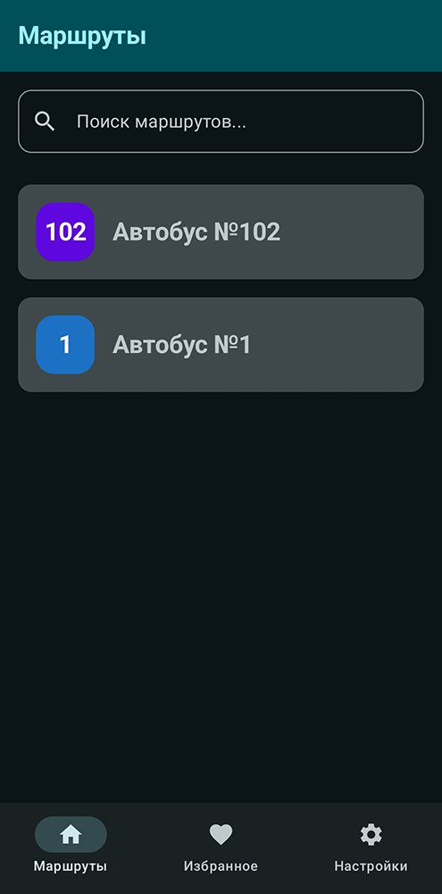
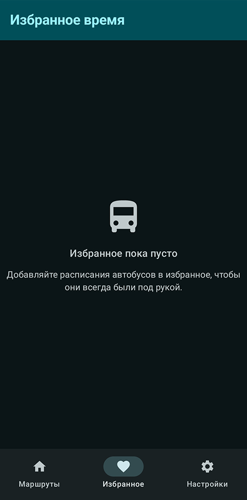

# 🚌 Поехали! Славгород
[](https://github.com/VseMirka200/lets_go_slavgorod/releases)
[](https://github.com/VseMirka200/lets_go_slavgorod/releases)
[](https://github.com/VseMirka200/lets_go_slavgorod)

## 📱 О приложении
**«Поехали! Славгород»** — это высокопроизводительное Android-приложение, разработанное командой энтузиастов для удобного просмотра расписания городских автобусов. Приложение обеспечивает быстрый доступ к актуальной информации о маршрутах и времени отправления автобусов.

### ⚠️ Важное уведомление
> **Это приложение — неофициальный проект и не связано с ООО «Транспорт». Мы разработали его для вашего удобства в качестве справочного сервиса!**

## ✨ Ключевые особенности
### 📱 **Функциональность**
- **Актуальное расписание** - регулярно обновляемое расписание автобусов
- **Офлайн работа** - все данные доступны без подключения к интернету
- **Умные уведомления** - настраиваемые напоминания о времени отправления
- **Избранные маршруты** - сохранение часто используемых маршрутов
- **Поиск в реальном времени** - быстрый поиск по номеру и названию маршрута
### 🎨 **Дизайн**
- **Material Design 3** - современный и интуитивный интерфейс
- **Темная/светлая тема** - автоматическое переключение по системным настройкам
- **Адаптивный дизайн** - оптимизирован для всех размеров экранов
- **Доступность** - поддержка скрин-ридеров и специальных возможностей
### 🔧 **Технические особенности**
- **Jetpack Compose** - современный UI toolkit
- **Room Database** - локальное хранение данных
- **Kotlin Coroutines** - асинхронное программирование
- **MVVM архитектура** - чистая и масштабируемая архитектура
- **Автоматические обновления** - система проверки и установки обновлений
## 📱 Скриншоты
<div align="center">
  
  
  
</div>

## 🛠 Технологии
### **Основной стек:**
- **Kotlin** - основной язык программирования
- **Jetpack Compose** - современный UI toolkit
- **Material Design 3** - дизайн-система
- **Android Architecture Components** - архитектурные компоненты
### **База данных:**
- **Room** - локальная база данных SQLite
- **DataStore** - хранение настроек приложения
- **Kotlin Coroutines** - асинхронная работа с данными
### **UI/UX:**
- **Navigation Compose** - навигация между экранами
- **ViewModel** - управление состоянием UI
- **StateFlow** - реактивные потоки данных
- **LazyColumn** - оптимизированные списки
### **Уведомления:**
- **AlarmManager** - планирование уведомлений
- **NotificationCompat** - совместимые уведомления
- **BroadcastReceiver** - обработка системных событий
## 📦 Установка
### **Требования:**
- Android 7.0 (API 24) или выше
- 50 МБ свободного места
- Разрешения: уведомления, точные будильники

### **Способы установки:**

#### 1. **Скачать APK (рекомендуется)**
```bash
# Скачайте последнюю версию из релизов
https://github.com/VseMirka200/lets_go_slavgorod/releases
```

#### 2. **Сборка из исходного кода**
```bash
# Клонирование репозитория
git clone https://github.com/VseMirka200/lets_go_slavgorod.git
cd lets_go_slavgorod

# Сборка проекта
./gradlew assembleDebug

# Установка на устройство
./gradlew installDebug
```

## 🚀 Разработка

### **Структура проекта:**
```
app/src/main/java/com/example/lets_go_slavgorod/
├── data/                    # Слой данных
│   ├── local/              # Локальная база данных
│   ├── model/              # Модели данных
│   └── repository/         # Репозитории
├── ui/                     # Слой представления
│   ├── components/         # UI компоненты
│   ├── screens/           # Экраны приложения
│   ├── navigation/        # Навигация
│   └── viewmodel/         # ViewModels
├── notifications/         # Система уведомлений
├── updates/               # Система обновлений
└── utils/                 # Утилиты
```

### **Архитектура:**
- **MVVM** - Model-View-ViewModel
- **Repository Pattern** - паттерн репозитория
- **Dependency Injection** - внедрение зависимостей
- **Clean Architecture** - чистая архитектура

### **Оптимизации производительности:**
- **LazyColumn** с оптимизированным кэшированием
- **StateFlow** с `SharingStarted.WhileSubscribed`
- **Remember** для кэширования вычислений
- **ProGuard** для минимизации размера APK

## 📊 Статистика проекта

- **📁 Файлов:** 50+ Kotlin файлов
- **📝 Строк кода:** 5000+ строк
- **🎨 UI компонентов:** 15+ Compose компонентов
- **📱 Экранов:** 8 основных экранов
- **🔧 Утилит:** 10+ вспомогательных классов

## 🤝 Участие в разработке

Мы приветствуем вклад в развитие проекта! Вот как вы можете помочь:

### **Способы участия:**
1. **🐛 Сообщения об ошибках** - создавайте issues с описанием проблем
2. **💡 Предложения** - делитесь идеями для улучшения
3. **📝 Документация** - улучшайте README и комментарии в коде
4. **🧪 Тестирование** - тестируйте новые функции и сообщайте о результатах

### **Как внести вклад:**
1. Fork репозитория
2. Создайте ветку для ваших изменений (`git checkout -b feature/amazing-feature`)
3. Commit ваши изменения (`git commit -m 'Add amazing feature'`)
4. Push в ветку (`git push origin feature/amazing-feature`)
5. Создайте Pull Request

## 📞 Обратная связь

### **Связь с разработчиками:**
- **💬 Telegram:** [@lets_go_slavgorod_bot](https://t.me/lets_go_slavgorod_bot)
- **📧 Email:** [Связаться с командой](mailto:contact@example.com)
- **🐛 Issues:** [GitHub Issues](https://github.com/VseMirka200/lets_go_slavgorod/issues)

### **Что сообщать:**
- Ошибки и баги
- Предложения по улучшению
- Проблемы с производительностью
- Идеи новых функций

## 📄 Лицензия

Этот проект распространяется под лицензией MIT. См. файл [LICENSE](LICENSE) для подробной информации.

## 🙏 Благодарности

- **Команде разработчиков** за создание и поддержку проекта
- **Сообществу Android** за отличные инструменты и библиотеки
- **Пользователям** за обратную связь и предложения
- **ООО "Транспорт"** за предоставление данных о маршрутах

## 🔮 Планы на будущее

### **Ближайшие обновления:**
- [ ] Полное покрытие всех городских маршрутов
- [ ] Поиск по остановкам
- [ ] Интеграция с картами
- [ ] Офлайн-карты маршрутов
- [ ] Виджеты для главного экрана

### **Долгосрочные цели:**
- [ ] Поддержка других городов
- [ ] Интеграция с транспортными API
- [ ] Машинное обучение для предсказания задержек
- [ ] Социальные функции (отзывы, рейтинги)

---

<div align="center">

**Сделано с ❤️ командой энтузиастов для жителей Славгорода**

[](https://github.com/VseMirka200/lets_go_slavgorod/stargazers)
[](https://github.com/VseMirka200/lets_go_slavgorod/network)
