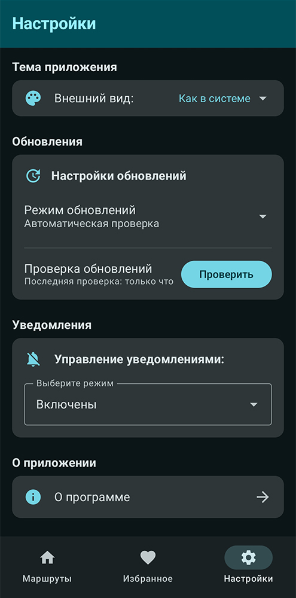
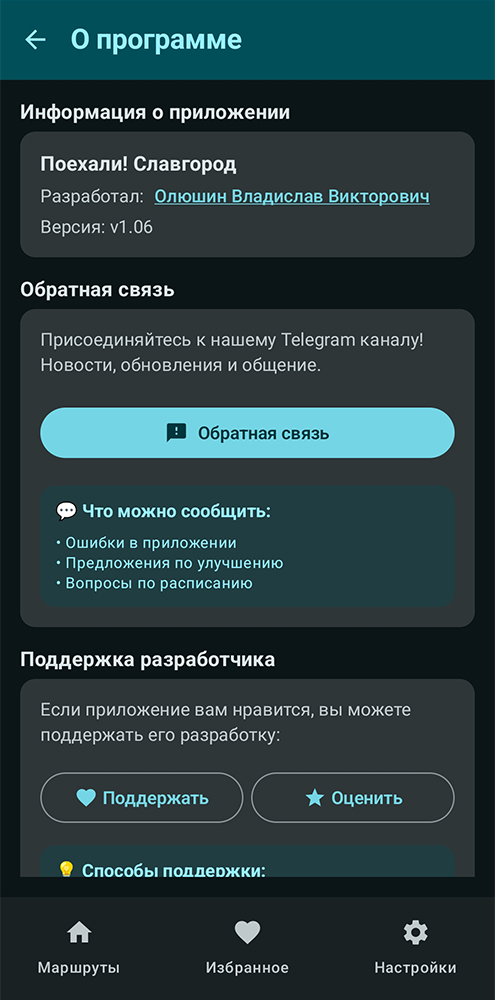

# Поехали! Славгород

# О приложении
**«Поехали! Славгород»** — это высокопроизводительное Android-приложение, разработанное командой энтузиастов для удобного просмотра расписания городских автобусов. Приложение обеспечивает быстрый доступ к актуальной информации о маршрутах и времени отправления автобусов.

### Важное
> **Это приложение — неофициальный проект и не связано с ООО «Транспорт». Мы разработали его для вашего удобства в качестве справочного сервиса!**

## Ключевые особенности

### **Функциональность**
- **Актуальное расписание** - регулярно обновляемое расписание автобусов
- **Офлайн работа** - все данные доступны без подключения к интернету
- **Умные уведомления** - настраиваемые напоминания о времени отправления
- **Избранные маршруты** - сохранение часто используемых маршрутов
- **Поиск в реальном времени** - быстрый поиск по номеру и названию маршрута

### **Дизайн**
- **Material Design 3** - современный и интуитивный интерфейс
- **Темная/светлая тема** - автоматическое переключение по системным настройкам
- **Адаптивный дизайн** - оптимизирован для всех размеров экранов
- **Доступность** - поддержка скрин-ридеров и специальных возможностей

### **Технические особенности**
- **Jetpack Compose** - современный UI toolkit
- **Room Database** - локальное хранение данных
- **Kotlin Coroutines** - асинхронное программирование
- **MVVM архитектура** - чистая и масштабируемая архитектура
- **Автоматические обновления** - система проверки и установки обновлений

## Скриншоты
   

## Требования
- Android 7.0 или выше
- 50 МБ свободного места
- Разрешения: уведомления, точные будильники

## Обратная связь
**Telegram бот:** [Открыть](https://t.me/lets_go_slavgorod_bot)

---

**Сделано с ❤️ командой энтузиастов для жителей Славгорода и Ярового**
